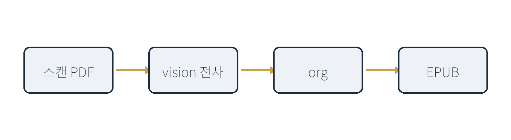
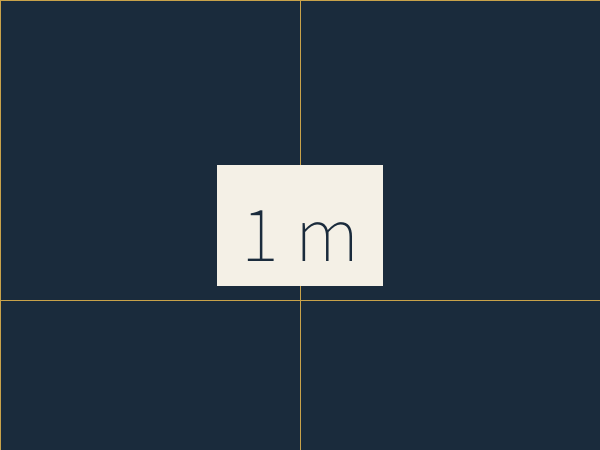
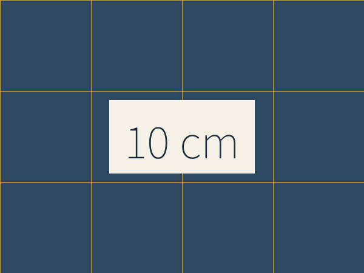
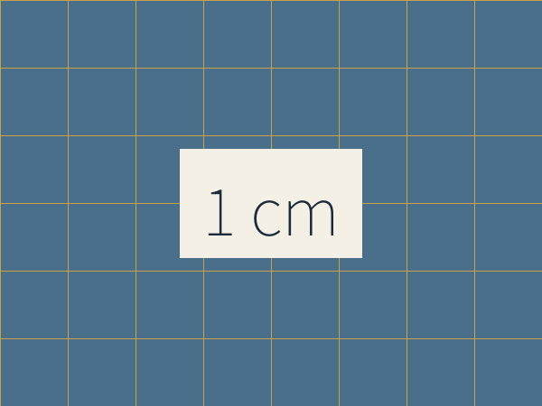
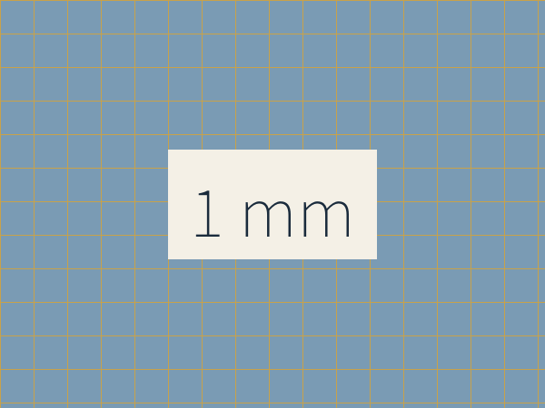

#+title:      조판 검증: ox-epub 풀세트 샘플
#+author:     Junghan Kim
#+language:   ko
#+date:       2026-06-01
#+uid:        urn:uuid:951c252e-5dfb-4340-9740-36047470ddbc
#+publisher:  junghanacs
#+license:    CC BY-SA 4.0
#+epubcover:  images/cover.png
#+options:    toc:t num:t H:4 tex:dvisvgm html-postamble:nil ^:{}
#+startup:    num

#+begin_comment
이 문서는 ox-epub 의 조판 충실도를 검증하기 위한 풀세트 샘플이다.
이미지 / 그림 묶음 / 정렬 / 수식(인라인·별행) / 표 / 각주 / 용어집 / 목차 /
한글 / 인용 / 리스트 / 코드블록 / 강조 / 특수문자(대시) 를 한 파일에 모두 담는다.
이 한 파일이 손실 없이 EPUB 3.0 으로 변환되고 epubcheck 를 통과하면,
같은 표준 형식으로 어떤 책이든 내보낼 수 있다는 근거가 된다.
#+end_comment

* 히스토리 :noexport:nonum:
- [2026-09-27 Sun 12:30] claudecode/opus: xhtml5 전환에 맞춰 그림 묶음·책 번호 캡션·정렬·각주 팝업·용어집 예시 추가. 한글 라벨(그림/표/각주/차례).
- [2026-09-27 Sun 11:05] org-glossary 모드도 활용할 생각이다.
- [2026-09-27 Sun 10:42] 이 페이지를 내 memex-kb와 연계한 페어 패키지로 관리할거야. 내보내기 대상을 확대하고, 기존에 org 문서 중에 조판을 따라가야 할 경우에 이 포멧에 맞춰서 수정하고 난 뒤에 epub 및 pdf 등 내보내기 테스트를 거치도록 하게 하는거야. 레퍼런스로써 의미가 있다.
- [2026-06-01 Mon 09:00] 생성

* 들어가며
:PROPERTIES:
:UNNUMBERED: t
:END:

이 장은 번호가 붙지 않는 머리말이다(=UNNUMBERED= 속성). 한글 본문이
EPUB 리더에서 어떻게 흐르는지, 자간과 줄바꿈이 자연스러운지 확인한다.

조판(組版, /typesetting/)은 단순히 글자를 늘어놓는 일이 아니다. 강조에는
*굵게*, /기울임/, =등폭=, ~코드~, +취소선+, 그리고 _밑줄_ 이 모두 제 역할을
한다. 위 첨자 H^{2}O, 아래 첨자 x_{i} 도 자주 쓰인다.

대시 조판도 책에서 중요하다. 하이픈(-), 엔대시(1--3쪽), 엠대시(생각을
끊는다 --- 이렇게) 는 서로 다른 글자다. 말줄임표(...) 도 마찬가지다.

* 본문 구조와 목차

이 장은 번호가 붙는 일반 장이다. 목차(=toc:t=)에 자동으로 등록되며,
하위 절·소절까지 =H:4= 깊이로 포함된다.

** 리스트 조판

순서 없는 목록:

- 첫째 항목
- 둘째 항목
  - 중첩된 항목 (들여쓰기 유지 확인)
  - 또 다른 중첩
- 셋째 항목

순서 있는 목록:

1. org 파일 준비
2. ox-epub 으로 EPUB export
3. epubcheck 로 검증

설명 목록(description list):

- 조판 :: 글자와 그림을 지면에 배치하는 일
- EPUB :: 웹페이지를 압축한 전자책 표준 포맷
- 각주 :: 본문 흐름을 끊지 않고 부연하는 장치[fn:1]

** 각주 조판

각주는 본문을 끊지 않고 부연한다. EPUB3 에서는 각주 참조가
~epub:type="noteref"~, 각주 본문이 ~<aside epub:type="footnote">~ 로 나가서,
지원하는 리더는 끝으로 넘기지 않고 팝업으로 보여 준다.

이름 붙은 각주[fn:naming]와 인라인 각주[fn:: 정의를 본문 안에 바로 쓰는
각주다.], 그리고 여러 문단짜리 각주[fn:long]도 확인한다.

** 인용과 예시 블록

#+begin_quote
좋은 글쓰기는 본질적으로 다시 쓰기다. --- 로알드 달
#+end_quote

코드 블록(등폭 조판, 구문 유지):

#+begin_src python
def org_to_epub(org_path: str) -> str:
    """org 파일을 EPUB 으로 변환한다."""
    return run_ox_epub(org_path)
#+end_src

* 수식 조판

EPUB 에서 수식은 =tex:dvisvgm= 옵션으로 SVG 이미지로 변환된다. 자바스크립트
없이 모든 리더에서 동일하게 렌더되고, 확대해도 선명하다.

인라인 수식: 질량-에너지 등가는 \( E = mc^2 \) 으로 표현된다. 또한 임의의
정수 \( n \) 에 대해 \( a_n = a_1 + (n-1)d \) 가 성립한다.

별행 수식(display):

\[ \int_{-\infty}^{\infty} e^{-x^2}\, dx = \sqrt{\pi} \]

연립 방정식도 확인한다:

\[ \begin{aligned} \nabla \cdot \mathbf{E} &= \frac{\rho}{\varepsilon_0} \\ \nabla \times \mathbf{B} &= \mu_0 \mathbf{J} + \mu_0\varepsilon_0 \frac{\partial \mathbf{E}}{\partial t} \end{aligned} \]

* 표 조판

표는 캡션과 번호를 달고 목차 아래 본문에 배치한다. 가로줄만 남기고
세로줄은 생략하는 것이 출판 관례다.

#+caption: 그리스 문자와 엔티티 변환 확인
#+name: tab-entity
| 입력      | 렌더 | 종류     |
|-----------+------+----------|
| \alpha    | α    | 그리스   |
| \le \ge   | ≤ ≥  | 부등호   |
| \times    | ×    | 연산자   |
| ---       | —    | 엠대시   |

책에서 옮긴 표는 책의 번호를 그대로 캡션에 둔다.

#+caption: 표 2-1: 길이의 단위
| 단위       | 미터로 |
|------------+--------|
| 센티미터   | 10^{-2}  |
| 밀리미터   | 10^{-3}  |
| 마이크로미터 | 10^{-6}  |

표 [[tab-entity]] 처럼 상호참조도 동작해야 한다. 위 글자들은 XHTML 의
명명 엔티티(=&alpha;= 등)로 나오는데, EPUB3 에서는 유니코드 문자로
변환되어야 파싱 오류가 나지 않는다.

* 그림 조판

그림은 캡션·번호와 함께 배치한다. EPUB 표준은 PNG 같은 개방 포맷을
권장한다(JPG 미지원 리더 존재).

#+caption: org → EPUB 변환 파이프라인
#+name: fig-flow
#+attr_html: :width 600 :alt 변환 파이프라인 도식 :align center

그림 [[fig-flow]] 은 전체 흐름을 요약한다. 본문에서 그림을 번호로
참조할 수 있어야 책 조판으로서 완결된다.

** 그림 묶음

책의 한 그림이 여러 장으로 이루어진 경우, OCR 은 하위 그림을 한 장씩
따로 뽑아 준다. 그 낱장들을 =#+begin_figure= 블록 하나로 묶으면 한
그림으로 조판된다. 블록의 캡션은 묶음 전체를, 각 낱장의 캡션은 하위
그림을 설명한다.

캡션이 책의 번호(=그림 1-1:=)로 시작하면 Org 의 자동 번호는 붙지 않는다.
책 캡션을 그대로 옮기면 된다.

#+caption: 크기에 따라 달리 보이는 현상
#+begin_figure
#+caption: 그림 1-1: 가로, 세로 각각 1 미터.
#+attr_html: :alt 1 미터 격자

#+caption: 그림 1-2: 10 센티미터.
#+attr_html: :alt 10 센티미터 격자

#+caption: 그림 1-3: 1 센티미터.
#+attr_html: :alt 1 센티미터 격자

#+caption: 그림 1-4: 1 밀리미터.
#+attr_html: :alt 1 밀리미터 격자

#+end_figure

** 그림 정렬

=#+attr_html: :align= 은 =left= / =right= / =center= 를 받는다. HTML5 에는
img 의 =align= 속성이 없으므로 ox-epub 이 =org-align-*= 클래스로 바꾼다.
=left= / =right= 는 본문이 그림을 감싸 흐른다.

#+attr_html: :align right :width 240 :alt 1 밀리미터 격자

이 문단은 오른쪽에 떠 있는 그림 옆으로 흐른다. 캡션이 없는 그림도
자리를 차지하며, 리더의 화면 폭이 좁으면 그림은 최대 절반 폭까지만
차지한다. 조판에서 그림과 글의 관계는 정렬 세 가지로 대부분 표현된다.

* Glossary
:PROPERTIES:
:UNNUMBERED: t
:END:

org-glossary 가 이 절을 읽어 용어를 정의하고, 내보낼 때 본문의 용어를
정의로 연결한다. 이 절 자체는 내보내지 않고, 정의 목록은 아래 =용어집=
절의 =#+print_glossary:= 자리에 찍힌다. 용어 뒤에 조사가 바로 붙으면
(=조판은=) 용어로 잡히지 않는다.

- 조판 :: 글자와 그림을 지면에 배치하는 일.
- 캡션 :: 그림이나 표에 붙는 설명 글.
- 각주 :: 본문 흐름을 끊지 않고 부연하는 장치.

* 맺으며
:PROPERTIES:
:UNNUMBERED: t
:END:

이 샘플이 EPUB 으로 충실히 변환되고 epubcheck 를 통과한다면, ox-epub 이
정의하는 표준 형식으로 어떤 책이든 내보낼 수 있다는 근거가 된다.

* 용어집
:PROPERTIES:
:UNNUMBERED: t
:END:

#+print_glossary: :only-contents yes

[fn:1] 이것이 각주다. EPUB 표준에서 각주는 별도 페이지 또는 팝업으로 렌더되며, W3C 호환성 이슈가 있는지 epubcheck 로 확인한다.

[fn:naming] 이름 붙은 각주도 번호로 다시 매겨진다.

[fn:long] 여러 문단짜리 각주의 첫 문단이다.

둘째 문단도 같은 각주 안에 남아야 한다.
